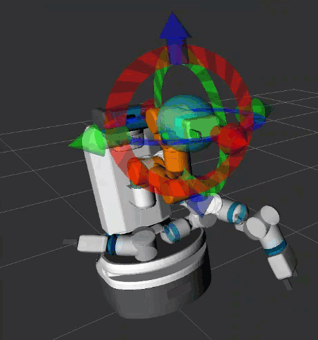
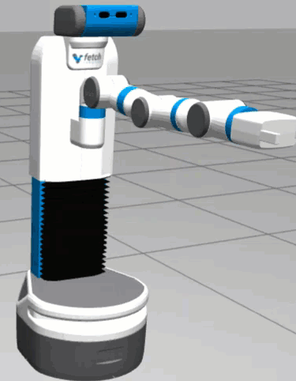

# fetch_motion_planning
MoveIt! package for planning optimal and collision-free trajectories on the Fetch mobile manipulator.

### Trajectory Execution in Simulation (with MoveIt! Motion Planning GUI)
Package: `fetch_moveit_config`
| Gazebo View      | RViZ View |
| :----:        |    :----:   |
|       |        |

 ### Trajectory Execution in Simulation (with custom scripts)
 Package: `my_motion_scripts`
| Gazebo View      | RViZ View |
| :----:        |    :----:   |
|       |        |
